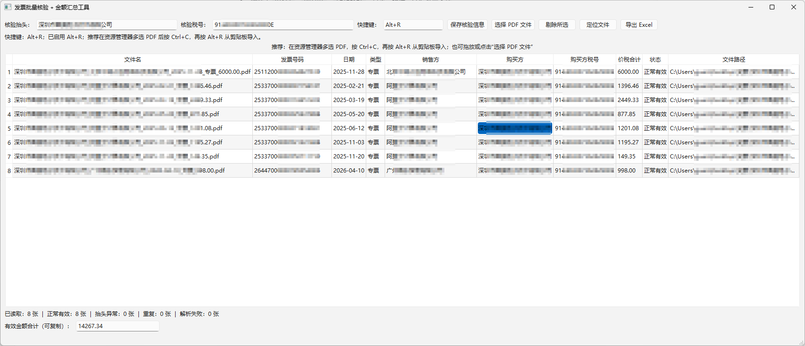

# 发票批量核验 + 金额汇总工具

Windows 离线桌面应用：批量导入 PDF 发票，严格核验购买方抬头和税号，读取发票号码、日期、普票/专票、销售方和价税合计（小写），检测重复票并导出 Excel。

## 界面预览



主界面支持配置核验抬头和税号、批量导入 PDF、查看发票号码/日期/类型/销售方/购买方/税号/金额/状态/文件路径，并可一键定位文件或导出 Excel。

## 功能规则

- 仅“正常有效”的发票计入合计；抬头不符、重复或解析失败一律不计入。
- 首次使用请在窗口顶部设置自己的购买方抬头和税号，并点击“保存核验信息”；设置会保留到下次启动。
- 重复检测同时使用发票号码与文件 SHA-256；即使文件名不同、内容相同也会被识别。
- 成功读取购买方、开票日期、票型和价税合计后，自动将原 PDF 改名为
  `购买方_销售方_YYYY-MM-DD_普票或专票_价税合计.pdf`；如果同名文件已存在，自动追加 `_2`、`_3`，不会覆盖文件。
- 结果表支持 Ctrl/Shift 多选行；右键选择“从结果中剔除”或按 Delete 键，可从本次结果和金额汇总中移除，原 PDF 文件始终保留。
- 优先读取 PDF 原生文本及文字坐标；扫描件会显示“解析失败”，为后续 OCR 扩展预留了提取层接口。
- SQLite 数据库保存于 `%LOCALAPPDATA%\InvoiceChecker\invoices.sqlite3`，用于跨次导入检测重复。

## 快捷键批量导入

安装版会随 Windows 登录启动后台快捷键助手。默认快捷键为 `Alt+R`，也可以在软件顶部“快捷键”输入框中点击后直接按新的组合键修改；如果组合键已被占用，软件会提示冲突。

推荐使用方式：

1. 在资源管理器中多选 PDF 发票。
2. 按 `Ctrl+C` 复制这些文件。
3. 按 `Alt+R`。
4. 工具会自动导入、解析、校验、重命名，并把本批正常有效发票的合计金额以纯数字复制到剪贴板。

注意：

- 快捷键批量汇总只允许本批已识别发票属于同一购买方；混入不同购买方时不会复制合计。
- 抬头不符、税号异常、重复票、解析失败不会计入合计。
- 如果快捷键不可用，可使用拖拽、选择文件，或右键/SendTo 菜单导入。
- 从源码运行时只启动主窗口；快捷键助手主要面向安装包场景。

## 运行

需要 Python 3.12（代码也兼容 3.13）。在项目目录执行：

```powershell
py -3.12 -m venv C:\venvs\invoice-checker
C:\venvs\invoice-checker\Scripts\python.exe -m pip install -r requirements.txt
$env:PYTHONPATH = "$PWD\src"
C:\venvs\invoice-checker\Scripts\python.exe -m invoice_checker
```

建议将虚拟环境放到类似 `C:\venvs` 的短路径；Qt 在未启用 Windows 长路径时，安装在过深目录可能失败。

## 测试

```powershell
$env:PYTHONPATH = "$PWD\src"
C:\venvs\invoice-checker\Scripts\python.exe -m pytest -q
```

测试会在临时目录构造嵌入中文字体的 PDF，覆盖字段解析、抬头异常、号码/SHA-256 重复检测、汇总和 Excel 导出。

## 打包

在 PowerShell 执行（构建脚本会显式收集 Qt 运行时，并排除与 Windows ICU 冲突的 DLL）：

```powershell
.\scripts\build.ps1
```

生成 `dist\InvoiceChecker-fixed\InvoiceChecker-fixed.exe` 后，再执行：

```powershell
.\scripts\install-context-menu.ps1
```

随后可在资源管理器中多选 PDF，右键选择“使用发票核验并复制合计”。软件会自动导入、改名，并将本批正常有效发票的合计以纯数字复制到剪贴板。菜单只写入当前 Windows 用户的注册表；如需移除，执行 `scripts\uninstall-context-menu.ps1`。

如果电脑未在 PDF 专用菜单显示该命令，安装脚本也会注册一个兼容入口；它可能显示在任意文件的“显示更多选项”中，但程序只会导入 PDF。

安装包会同时启动后台快捷键助手；快捷键用法见上方“快捷键批量导入”。

右键批量汇总要求本批所有已识别发票的购买方完全一致；如购买方混杂，软件会导入文件但不会复制合计，并在窗口底部说明原因。

也可替换为 Nuitka；业务代码不依赖打包器。

## 自动发布 Release

仓库已配置 GitHub Actions：当推送 `v` 开头的版本标签时，会自动在 Windows 环境运行测试、打包程序、生成安装包，并创建 GitHub Release。

发布新版本示例：

```powershell
git tag v1.0.1
git push origin v1.0.1
```

发布完成后，用户可在 GitHub Releases 页面下载 `InvoiceChecker-Setup.exe` 安装包。

也可以在 GitHub 仓库页面进入 `Actions` → `Build Windows Release` → `Run workflow`，手动触发一次构建；手动触发只会生成构建产物，不会创建正式 Release。
